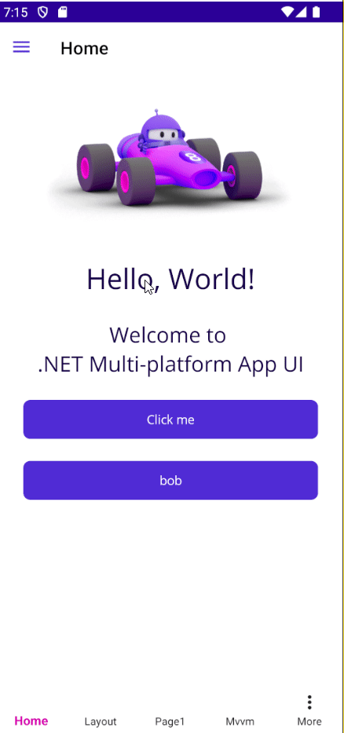

# À propos ?

Réaliser une page de détail de type "à propos" pour Flashcard.

Par exemple, comme ceci :



<details>
<summary>
Aide pour le XAML
</summary>

```csharp
<?xml version="1.0" encoding="utf-8" ?>
<ContentPage xmlns="http://schemas.microsoft.com/dotnet/2021/maui"
             xmlns:x="http://schemas.microsoft.com/winfx/2009/xaml"
             x:Class="YourAppNamespace.AboutPage"
             Title="About"
             BackgroundColor="White">

    <ContentPage.ToolbarItems>
        <ToolbarItem Text="Close" Clicked="CloseButton_Clicked">
            <ToolbarItem.IconImageSource>
                <FontImageSource FontFamily="FontAwesome" 
                                Glyph="&#xf00d;" 
                                Color="Black" />
            </ToolbarItem.IconImageSource>
        </ToolbarItem>
    </ContentPage.ToolbarItems>

    <ScrollView>
        <VerticalStackLayout Padding="0,40,0,20" Spacing="10">
            <!-- App Logo -->
            <Image Source="app_logo.png"
                   HeightRequest="120"
                   WidthRequest="120"
                   HorizontalOptions="Center" />

            <!-- App Title -->
            <Label Text="Your App Name"
                   FontSize="24"
                   FontAttributes="Bold"
                   HorizontalOptions="Center"
                   Margin="0,10,0,5" />

            <!-- Version Info -->
            <Label x:Name="VersionLabel"
                   FontSize="16"
                   TextColor="Gray"
                   HorizontalOptions="Center"
                   Margin="0,0,0,20" />

            <!-- Description -->
            <Label Text="Your App is a powerful tool designed to help users accomplish their goals efficiently and effectively."
                   FontSize="16"
                   HorizontalOptions="Center"
                   HorizontalTextAlignment="Center"
                   Margin="20,0,20,20" />

            <!-- Website Button -->
            <Button Text="Visit Our Website"
                    BackgroundColor="Blue"
                    TextColor="White"
                    CornerRadius="8"
                    Margin="20,0,20,10"
                    Clicked="WebsiteButton_Clicked" />

            <!-- Privacy Policy Button -->
            <Button Text="Privacy Policy"
                    BackgroundColor="Blue"
                    TextColor="White"
                    CornerRadius="8"
                    Margin="20,0,20,10"
                    Clicked="PrivacyButton_Clicked" />

            <!-- Terms of Service Button -->
            <Button Text="Terms of Service"
                    BackgroundColor="Blue"
                    TextColor="White"
                    CornerRadius="8"
                    Margin="20,0,20,10"
                    Clicked="TermsButton_Clicked" />

            <!-- Copyright -->
            <Label x:Name="CopyrightLabel"
                   FontSize="14"
                   TextColor="Gray"
                   HorizontalOptions="Center"
                   Margin="0,20,0,0" />

            <!-- Contact Info -->
            <Label Text="Contact us: support@yourcompany.com"
                   FontSize="14"
                   TextColor="Gray"
                   HorizontalOptions="Center"
                   Margin="0,5,0,0" />

        </VerticalStackLayout>
    </ScrollView>
</ContentPage>
```
</details>

<details>

<summary>Aide pour le code behind</summary>


```csharp

using Microsoft.Maui.Controls;
using System;


public partial class AboutPage : ContentPage
{
    public AboutPage()
    {
        InitializeComponent();

        // Set the version and copyright labels
        VersionLabel.Text = $"Version {AppInfo.VersionString} (Build {AppInfo.BuildString})";
        CopyrightLabel.Text = $"© {DateTime.Now.Year} Your Company. All rights reserved.";
    }

    private void CloseButton_Clicked(object sender, EventArgs e)
    {
        // For AppShell flyout navigation, this will return to the default route
        Shell.Current.CurrentItem = Shell.Current.Items[0];
    }

    private async void WebsiteButton_Clicked(object sender, EventArgs e)
    {
        await OpenUrl("https://yourwebsite.com");
    }

    private async void PrivacyButton_Clicked(object sender, EventArgs e)
    {
        await OpenUrl("https://yourwebsite.com/privacy");
    }

    private async void TermsButton_Clicked(object sender, EventArgs e)
    {
        await OpenUrl("https://yourwebsite.com/terms");
    }

    private async Task OpenUrl(string url)
    {
        if (await DisplayAlert("Open Website", $"Would you like to open {url}?", "Yes", "No"))
        {
            try
            {
                await Browser.OpenAsync(url, BrowserLaunchMode.SystemPreferred);
            }
            catch (Exception ex)
            {
                await DisplayAlert("Error", $"Unable to open website: {ex.Message}", "OK");
            }
        }
    }
}
```

</details>
