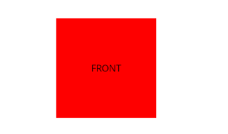

# Flip

## Mission 1
Suite à [l’exercice précédent](https://labs.section-inf.ch/codelabs/mobile-06-animation/index.html?index=..%2F..index#0) et en s’aidant de la [documentation](https://learn.microsoft.com/en-us/dotnet/maui/user-interface/animation/basic), réaliser une animation similaire à celle présentée ci-dessus qui pourra être reprise pour FlashCard

## Mission 2
Intégrer cette animation dans le projet