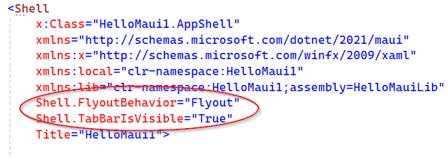

# Menu

## Échauffement
Commencer par créer un projet MAUI et y ajouter une page
[Ajouter une page à un projet](https://labs.section-inf.ch/codelabs/mobile-02-addPage/index.html?index=..%2F..index)

## Flashcard
Implémenter un tabbar (shell) pour flashcard avec, au minimum, les entrées suivantes :

- Jouer
- Configurer
- À propos

### Option
Activer le mode Flyout et Tabbar en même temps

Aide

