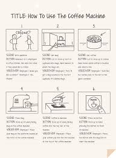

# Storyboard Flashquizz

## Contexte
Le but est de créer un simili simplifié de [quizzlet](https://quizlet.com/)

### Cahier des charges
[Flashquizz](ICT-335-CDC-PROJ.pdf)

### Storyboard
Un storyboard est une maquette de l’application contenant
- Les écrans
- La navigation
- Les actions

#### Exemple
1. Café

2. Application

#### Importance de cette étape 🚀
Cette partie d’analyse est **primordiale** pour éviter de perdre du temps sur des éléments non essentiels
ainsi que réfléchir à différents détails (idéalement avec le client)...

## Livrable
Un document PDF de qualité **professionnelle** :
- 🧪 Contenu relu et comparé au cahier des charges
- ⚠  Attention à l’orthographe
- ℹ  Renseigner les entêtes du fichier
- 📛 Nommer le fichier avec pertinence (par exemple `luke-flashquizz-storyboard-v1.pdf`)