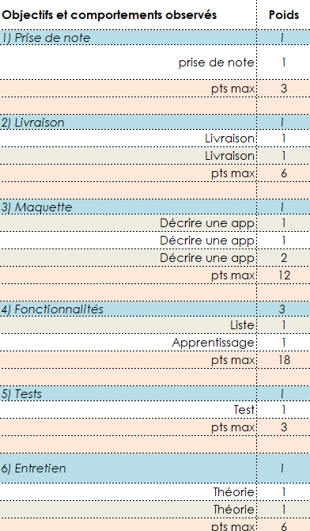

# Évaluation ✔

## Contenu
### Application "flashquizz" 🃏
Développement pas à pas d’une application de type "flashcards" (aka quizlet)

#### Cahier des charges
[CDC Flashquizz](activites/storyboard/ICT-335-CDC-PROJ.pdf)

### Entretien professionnel 🎦

- Une trentaine de questions à raison de 5 par séquence
- 3 questions tirées au hasard
  - 5 minutes de préparation
  - Interview technique de 5-10 minutes 

### Prise de notes 📓
Les éléments de théorie ne sont pas fournis, les élèves doivent **prendre des notes**
qui sont prises en compte dans l’évaluation.

## Pondération 📊

## DEP
[Lien DEP](https://eduvaud.sharepoint.com/:w:/s/msteams_d0db31/EZx8v2tv4vdFlzdZsFkGN64BvvNLmakWvB-OZ5VpbgiBQA?e=Ondj9Z)

## Progression 📈
- Formative à 50%
- Définitive à 100% (voir [Pondération](#pondération-))