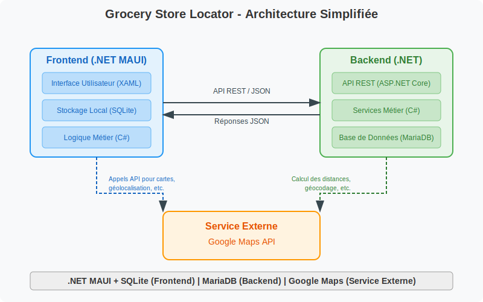

# Développement Mobile : Opportunités et Technologies 📱

## Différence entre application "normale" et mobile

Les applications mobiles diffèrent des applications traditionnelles ("normales") par plusieurs aspects fondamentaux :

- **Interface utilisateur adaptée** : Conçue pour les écrans tactiles de petite taille
- **Ressources limitées** : Gestion optimisée de la batterie, de la mémoire et du stockage
- **Connectivité variable** : Fonctionnement en mode hors ligne ou avec une connexion intermittente
- **Fonctionnalités spécifiques** : Accès aux capteurs du dispositif (GPS, accéléromètre, caméra, etc.)
- **Distribution contrôlée** : Déploiement via des magasins d'applications (App Store, Google Play)
- **Expérience utilisateur** : Navigation adaptée aux comportements mobiles (gestes, interactions rapides)

## Technologies, avantages et inconvénients

### Web (y compris WebAssembly)

- **Avantages** : Déploiement rapide, accessibilité multiplateforme, mise à jour instantanée
- **Inconvénients** : Performances limitées, accès restreint aux fonctionnalités natives, expérience utilisateur moins
  fluide
- **Technologies** : HTML5, CSS3, JavaScript, Progressive Web Apps (PWA), WebAssembly

### Natif spécifique

- **Android (Java)**
    - **Avantages** : Performances optimales, accès complet aux API du système, expérience utilisateur cohérente
    - **Inconvénients** : Développement spécifique à une plateforme, compétences spécialisées requises

- **iOS (Objective-C, Swift)**
    - **Avantages** : Performances élevées, interface utilisateur cohérente avec les directives Apple
    - **Inconvénients** : Limité à l'écosystème Apple, nécessite des Mac pour le développement

### Natif lié

- **Kivy (Python)**
    - **Avantages** : Développement cross-platform avec Python, bonne communauté
    - **Inconvénients** : Performances modérées, interface parfois non native

- **Kotlin**
    - **Avantages** : Langage moderne pour Android, interopérable avec Java
    - **Inconvénients** : Principalement centré sur Android (bien que Kotlin Multiplatform évolue)

### Natif avec runtime

- **.NET MAUI (Mono)**
    - **Avantages** : Code partagé entre plateformes, écosystème Microsoft
    - **Inconvénients** : Taille de l'application, performances parfois inférieures au natif

- **React Native (JavaScript)**
    - **Avantages** : Développement rapide, large communauté, réutilisation des compétences web
    - **Inconvénients** : Dépendance aux ponts natifs, performances variables selon la complexité

- **Flutter**
    - **Avantages** : UI cohérente sur toutes les plateformes, performances proches du natif
    - **Inconvénients** : Écosystème plus jeune, apprentissage de Dart

## Accès aux fonctionnalités matérielles

### Peut-on utiliser l'accéléromètre en HTML ?

Oui, c'est possible grâce à l'API DeviceMotion et DeviceOrientation en JavaScript :

```javascript
window.addEventListener('devicemotion', function (event) {
  // Option 1: Accélération avec gravité
  var x = event.accelerationIncludingGravity.x;
  var y = event.accelerationIncludingGravity.y;
  var z = event.accelerationIncludingGravity.z;

  // Option 2: Accélération sans gravité
  // var x = event.acceleration.x;
  // var y = event.acceleration.y;
  // var z = event.acceleration.z;

  // Traitement des données...
});
```

>Cependant, l'accès à ces API est soumis à des restrictions de sécurité dans les navigateurs modernes et peut nécessiter
une autorisation explicite de l'utilisateur.

## Processus de développement

### Par quoi commencer : code ou storyboard ?

Comme pour toute application, la meilleure pratique recommande généralement de commencer par le storyboard 
(conception) avant le code :

1. **Définir les besoins utilisateurs**
2. **Créer des wireframes/maquettes**
3. **Prototyper l'interface**
4. **Valider avec les utilisateurs**
5. **Développer**
6. **Tester**
7. **Déployer**

### Outils pour la création de maquettes

- **Pencil** : Solution open-source pour wireframes
- **Excalidraw** : Outil de dessin collaboratif minimaliste
- **Figma** : Plateforme collaborative de conception d'interface (très populaire)
- **PowerPoint** : Outil accessible pour des maquettes simples
- **Visio** : Solution Microsoft orientée diagrammes
- **Paint** : Basique mais accessible pour des concepts simples
- **Autres options** : Sketch, Adobe XD, InVision, Marvel, Balsamiq

## Exemple d'architecture



"Grocery Store Locator", une application fictive pour trouver le magasin le plus proche illustrerait un cas 
d'utilisation typique pouvant combiner :

- Géolocalisation
- Filtrage par type de magasin
- Recherche par distance
- Recherche de produits spécifiques
- Cartographie interactive

## Considérations importantes pour le développement mobile ⚠

- **Performance** : Optimisation pour les appareils aux ressources limitées
- **Expérience utilisateur** : Conception adaptée aux contraintes mobiles (taille d'écran, interaction tactile)
- **Connectivité** : Gestion des modes hors ligne et de la synchronisation
- **Sécurité** : Protection des données sur l'appareil
- **Consommation énergétique** : Optimisation pour préserver la batterie
- **Tests** : Vérification sur différents appareils et versions OS
