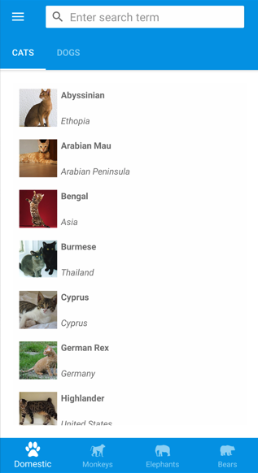

# Le Shell dans MAUI



Le Shell est un modèle de navigation moderne introduit par MAUI pour simplifier l'organisation d’une application.

### Concepts Clés du Shell

- **AppShell** : Classe principale qui définit la structure de navigation globale
- **FlyoutItem** : Élément accessible depuis un menu latéral (Flyout/Hamburger menu)
- **TabBar** : Barre de navigation avec onglets
- **ShellContent** : Contenu spécifique affiché dans un onglet ou un élément de Flyout

## Démarrage d'une Application MAUI

### Fichier App.xaml.cs

```csharp
public partial class App : Application
{
    public App()
    {
        InitializeComponent();
        MainPage = new AppShell();
    }
}
```

### Fichier AppShell.xaml

```xml
<?xml version="1.0" encoding="UTF-8" ?>
<Shell
    x:Class="MonApplication.AppShell"
    xmlns="http://schemas.microsoft.com/dotnet/2021/maui"
    xmlns:x="http://schemas.microsoft.com/winfx/2009/xaml"
    xmlns:local="clr-namespace:MonApplication.Views"
    Shell.FlyoutBehavior="Flyout">

    <FlyoutItem Title="Accueil" Icon="home.png">
        <ShellContent
            Title="Accueil"
            ContentTemplate="{DataTemplate local:AccueilPage}" />
    </FlyoutItem>

    <TabBar>
        <Tab Title="Profil" Icon="profile.png">
            <ShellContent
                Title="Mon Profil"
                ContentTemplate="{DataTemplate local:ProfilPage}" />
        </Tab>
        <Tab Title="Paramètres" Icon="settings.png">
            <ShellContent
                Title="Configuration"
                ContentTemplate="{DataTemplate local:ParametresPage}" />
        </Tab>
    </TabBar>
</Shell>
```

## Shell avec Flyout (Menu Latéral)

Le Flyout est un menu latéral accessible généralement par un bouton "hamburger" ou par un geste de balayage.

### Configuration du Flyout

```xml
<Shell
    x:Class="MonApplication.AppShell"
    ...
    Shell.FlyoutBehavior="Flyout"
    FlyoutHeaderBehavior="CollapseOnScroll"
    FlyoutBackgroundColor="#f1f1f1">
    
    <!-- En-tête du Flyout -->
    <Shell.FlyoutHeader>
        <Grid HeightRequest="200" BackgroundColor="DarkBlue">
            <Image Source="logo.png" />
            <Label Text="Mon Application" TextColor="White" 
                   FontSize="24" VerticalOptions="End" Margin="20" />
        </Grid>
    </Shell.FlyoutHeader>
    
    <!-- Éléments du menu -->
    <FlyoutItem Title="Accueil" Icon="home.png">
        <ShellContent ContentTemplate="{DataTemplate local:AccueilPage}" />
    </FlyoutItem>
    <FlyoutItem Title="Profil" Icon="profile.png">
        <ShellContent ContentTemplate="{DataTemplate local:ProfilPage}" />
    </FlyoutItem>
</Shell>
```

## Shell avec TabBar (Onglets)

La TabBar permet d'organiser le contenu en onglets accessibles depuis une barre inférieure.

### Configuration de la TabBar

```xml
<Shell ...>
    <TabBar>
        <Tab Title="Accueil" Icon="home.png">
            <ShellContent ContentTemplate="{DataTemplate local:AccueilPage}" />
        </Tab>
        <Tab Title="Recherche" Icon="search.png">
            <ShellContent ContentTemplate="{DataTemplate local:RecherchePage}" />
        </Tab>
        <Tab Title="Notifications" Icon="bell.png">
            <ShellContent ContentTemplate="{DataTemplate local:NotificationsPage}" />
        </Tab>
        <Tab Title="Paramètres" Icon="gear.png">
            <ShellContent ContentTemplate="{DataTemplate local:ParametresPage}" />
        </Tab>
    </TabBar>
</Shell>
```

## Navigation avec Shell

```csharp
// Enregistrement des routes
public AppShell()
{
    InitializeComponent();
    
    Routing.RegisterRoute("details", typeof(DetailsPage));
    Routing.RegisterRoute("profil/edit", typeof(EditProfilPage));
}

// Navigation avec paramètres
async void OnItemClicked(object sender, EventArgs e)
{
    var item = (sender as Button).CommandParameter as Item;
    
    await Shell.Current.GoToAsync($"details?id={item.Id}");
}

// Réception des paramètres avec QueryProperty
[QueryProperty(nameof(ItemId), "id")]
public partial class DetailsPage : ContentPage
{
    private string itemId;
    
    public string ItemId
    {
        get => itemId;
        set
        {
            itemId = value;
            LoadItem(value);
        }
    }
    
    private void LoadItem(string id)
    {
        // Charger l'élément spécifique
    }
}
```

## Combinaison Flyout et TabBar
On peut combiner flyout et tab, toutefois il y a plusieurs éléments à considérer pour éviter 
des problèmes de navigation et d'expérience utilisateur.

### Structure possible

```xml
<Shell
    x:Class="MonApplication.AppShell"
    xmlns="http://schemas.microsoft.com/dotnet/2021/maui"
    xmlns:x="http://schemas.microsoft.com/winfx/2009/xaml"
    xmlns:views="clr-namespace:MonApplication.Views"
    Shell.FlyoutBehavior="Flyout">
    
    <!-- Élément simple du Flyout -->
    <FlyoutItem Title="Accueil" Icon="home.png">
        <ShellContent ContentTemplate="{DataTemplate views:AccueilPage}" />
    </FlyoutItem>
    
    <!-- Élément du Flyout contenant des onglets -->
    <FlyoutItem Title="Catalogue" Icon="catalog.png">
        <Tab Title="Produits">
            <ShellContent ContentTemplate="{DataTemplate views:ProduitsPage}" />
        </Tab>
        <Tab Title="Catégories">
            <ShellContent ContentTemplate="{DataTemplate views:CategoriesPage}" />
        </Tab>
        <Tab Title="Promotions">
            <ShellContent ContentTemplate="{DataTemplate views:PromotionsPage}" />
        </Tab>
    </FlyoutItem>
    
    <!-- Autre élément simple du Flyout -->
    <FlyoutItem Title="Profil" Icon="profile.png">
        <ShellContent ContentTemplate="{DataTemplate views:ProfilPage}" />
    </FlyoutItem>
</Shell>
```

### Points d'attention

1. **Hiérarchie de navigation complexe** :
   - La combinaison crée une hiérarchie à deux niveaux qui peut parfois dérouter les utilisateurs
   - Les utilisateurs doivent comprendre qu'ils doivent d'abord sélectionner un élément du Flyout, puis naviguer entre 
   les onglets

2. **Onglets invisibles** :
   - Les onglets ne sont visibles que lorsque le `FlyoutItem` parent est sélectionné
   - Cela peut créer une navigation "cachée" que certains utilisateurs pourraient ne pas découvrir

3. **Comportement selon les plateformes** :
   - Sur iOS, le comportement du Flyout et des onglets peut différer de celui d'Android
   - Sur certaines plateformes, les onglets apparaissent en bas, tandis que sur d'autres, ils peuvent 
   apparaître en haut

4. **Profondeur de navigation excessive** :
   - Évitez de créer une navigation trop profonde (Flyout → Tab → NavigationPage → Pages imbriquées)
   - Limitez-vous idéalement à 2-3 niveaux de navigation

5. **Titres et icônes cohérents** :
   - Assurez-vous que les titres des `FlyoutItem` et des `Tab` sont clairs et distincts
   - Utilisez des icônes significatives pour aider à la compréhension

6. **Gestion de l'état actif** :
   - Par défaut, quand vous naviguez à partir d'un Tab vers une page détaillée, l'état actif de l'onglet peut être perdu
   - Utilisez le système de routes de Shell pour maintenir le contexte de navigation

### Recommandations pour une meilleure expérience utilisateur

1. **Utilisez cette combinaison avec parcimonie** : Ne créez pas un Flyout avec trop d'éléments contenant chacun de nombreux onglets

2. **Privilégiez les cas d'usage appropriés** : Cette structure est idéale pour des applications avec des sections distinctes, chacune avec des sous-sections liées

3. **Testez sur toutes les plateformes** : Le comportement peut varier significativement entre iOS, Android et Windows

4. **Fournissez des indications visuelles** : Assurez-vous que les utilisateurs comprennent qu'il y a des onglets disponibles dans certaines sections

5. **Considérez la mise en page adaptative** : Sur les grands écrans, envisagez d'afficher le Flyout en permanence à côté des onglets

## Exemple Complet d'Application MAUI

### AppShell.xaml (Combinant Flyout et TabBar)

```xml
<?xml version="1.0" encoding="UTF-8" ?>
<Shell
    x:Class="MonApplicationMAUI.AppShell"
    xmlns="http://schemas.microsoft.com/dotnet/2021/maui"
    xmlns:x="http://schemas.microsoft.com/winfx/2009/xaml"
    xmlns:views="clr-namespace:MonApplicationMAUI.Views"
    Shell.FlyoutBehavior="Flyout"
    Title="Mon Application MAUI">

    <!-- Menu Flyout -->
    <FlyoutItem Title="Tableau de bord" Icon="dashboard.png">
        <ShellContent ContentTemplate="{DataTemplate views:DashboardPage}" />
    </FlyoutItem>
    
    <FlyoutItem Title="Profil" Icon="profile.png">
        <ShellContent ContentTemplate="{DataTemplate views:ProfilePage}" />
    </FlyoutItem>
    
    <!-- Section avec onglets -->
    <FlyoutItem Title="Gestion" Icon="manage.png">
        <Tab Title="Produits">
            <ShellContent ContentTemplate="{DataTemplate views:ProductsPage}" />
        </Tab>
        <Tab Title="Commandes">
            <ShellContent ContentTemplate="{DataTemplate views:OrdersPage}" />
        </Tab>
        <Tab Title="Clients">
            <ShellContent ContentTemplate="{DataTemplate views:CustomersPage}" />
        </Tab>
    </FlyoutItem>

    <FlyoutItem Title="Paramètres" Icon="settings.png">
        <ShellContent ContentTemplate="{DataTemplate views:SettingsPage}" />
    </FlyoutItem>
    
    <FlyoutItem Title="Aide" Icon="help.png">
        <ShellContent ContentTemplate="{DataTemplate views:HelpPage}" />
    </FlyoutItem>
</Shell>
```

### Exemple de Page XAML

```xml
<?xml version="1.0" encoding="utf-8" ?>
<ContentPage xmlns="http://schemas.microsoft.com/dotnet/2021/maui"
             xmlns:x="http://schemas.microsoft.com/winfx/2009/xaml"
             xmlns:vm="clr-namespace:MonApplicationMAUI.ViewModels"
             x:Class="MonApplicationMAUI.Views.ProductsPage"
             Title="Liste des Produits">
    
    <ContentPage.BindingContext>
        <vm:ProductsViewModel />
    </ContentPage.BindingContext>
    
    <Grid RowDefinitions="Auto,*">
        <!-- Barre de recherche -->
        <SearchBar Grid.Row="0" Placeholder="Rechercher un produit..." 
                   Text="{Binding SearchQuery}"
                   SearchCommand="{Binding SearchCommand}" />
        
        <!-- Liste des produits -->
        <CollectionView Grid.Row="1" 
                       ItemsSource="{Binding Products}"
                       SelectionMode="Single"
                       SelectionChangedCommand="{Binding ProductSelectedCommand}"
                       SelectionChangedCommandParameter="{Binding SelectedItem, Source={RelativeSource Self}}">
            
            <CollectionView.EmptyView>
                <VerticalStackLayout VerticalOptions="Center" HorizontalOptions="Center">
                    <Image Source="noproducts.png" HeightRequest="120" />
                    <Label Text="Aucun produit trouvé" 
                           FontSize="18" TextColor="Gray" Margin="0,10,0,0" />
                </VerticalStackLayout>
            </CollectionView.EmptyView>
            
            <CollectionView.ItemTemplate>
                <DataTemplate>
                    <Frame Margin="10" Padding="15" BorderColor="LightGray">
                        <Grid ColumnDefinitions="Auto,*,Auto">
                            <Image Grid.Column="0" Source="{Binding ImageUrl}" 
                                   HeightRequest="60" WidthRequest="60" />
                            
                            <VerticalStackLayout Grid.Column="1" Margin="10,0">
                                <Label Text="{Binding Name}" FontSize="16" FontAttributes="Bold" />
                                <Label Text="{Binding Description}" FontSize="14" TextColor="Gray" />
                            </VerticalStackLayout>
                            
                            <Label Grid.Column="2" Text="{Binding Price, StringFormat='{0:C}'}" 
                                   FontSize="18" TextColor="DarkGreen" VerticalOptions="Center" />
                        </Grid>
                    </Frame>
                </DataTemplate>
            </CollectionView.ItemTemplate>
        </CollectionView>
    </Grid>
</ContentPage>
```

## Points Importants à Retenir

1. **Shell vs Navigation Classique** : Shell offre une navigation plus moderne et simplifiée par rapport à la navigation par `NavigationPage` classique.

2. **Binding dans XAML** : Le XAML utilise un système de binding puissant qui lie les propriétés des contrôles à celles du ViewModel.

3. **Route Shell vs URI** : Les routes Shell sont basées sur des URI qui peuvent contenir des paramètres. Par exemple : `details?id=123`.

4. **Personnalisation** : Vous pouvez personnaliser l'apparence de votre Shell avec des styles, des templates et des comportements.

5. **Adaptabilité** : Le Shell s'adapte automatiquement aux différentes plateformes, en respectant les conventions de chacune (par exemple, le Flyout s'affiche différemment sur iOS et Android).
