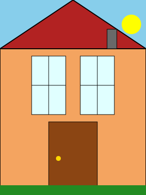

# Layouts de page dans Maui

Comme avec CSS, il existe plusieurs layouts avec MAUI...

## 1. StackLayout

Le StackLayout empile les éléments verticalement (par défaut) ou horizontalement.

```csharp
<StackLayout Spacing="10" Margin="10">
    <Label Text="Premier élément" />
    <Button Text="Deuxième élément" />
    <Entry Placeholder="Troisième élément" />
</StackLayout>
```

## 2. Grid

Le Grid permet d'organiser les éléments en lignes et colonnes.

```csharp
<Grid RowDefinitions="Auto,*,100" ColumnDefinitions="*,2*">
    <Label Text="En haut à gauche" Grid.Row="0" Grid.Column="0" />
    <Button Text="En haut à droite" Grid.Row="0" Grid.Column="1" />
    <Entry Placeholder="Sur deux colonnes" Grid.Row="1" Grid.ColumnSpan="2" />
</Grid>
```

## 3. FlexLayout

Le FlexLayout permet un arrangement flexible des éléments.

```csharp
<FlexLayout Direction="Row" Wrap="Wrap" JustifyContent="SpaceAround">
    <Label Text="Élément 1" />
    <Button Text="Élément 2" />
    <Entry Placeholder="Élément 3" WidthRequest="150" />
</FlexLayout>
```

## 4. AbsoluteLayout

L'AbsoluteLayout permet de positionner précisément les éléments avec des coordonnées.

```csharp
<AbsoluteLayout>
    <Label Text="Position exacte" AbsoluteLayout.LayoutBounds="50,30,200,50" />
    <Button Text="Proportionnel" 
            AbsoluteLayout.LayoutBounds="0.5,0.5,100,50" 
            AbsoluteLayout.LayoutFlags="PositionProportional" />
</AbsoluteLayout>
```

## 5. HorizontalStackLayout et VerticalStackLayout

Versions spécialisées du StackLayout avec orientation fixe.

```csharp
<HorizontalStackLayout Spacing="10">
    <Label Text="Côte à côte 1" />
    <Button Text="Côte à côte 2" />
</HorizontalStackLayout>
```

## 6. CollectionView

Pour afficher des collections de données avec virtualisation.

```csharp
<CollectionView ItemsSource="{Binding Items}">
    <CollectionView.ItemTemplate>
        <DataTemplate>
            <Label Text="{Binding Name}" />
        </DataTemplate>
    </CollectionView.ItemTemplate>
</CollectionView>
```

Chacun de ces layouts a des avantages spécifiques selon le design que vous souhaitez créer. Le Grid est polyvalent, 
le StackLayout est simple, le FlexLayout est adaptatif, et l'AbsoluteLayout offre un contrôle précis.

## Exemple
Que représente cette page ?
```csharp
<?xml version="1.0" encoding="utf-8" ?>
<ContentPage xmlns="http://schemas.microsoft.com/dotnet/2021/maui"
xmlns:x="http://schemas.microsoft.com/winfx/2009/xaml"
x:Class="MaisonExample.MaisonGridPage"
Title="Maison avec Grid"
BackgroundColor="LightBlue">

    <Grid WidthRequest="300" 
          HeightRequest="400"
          HorizontalOptions="Center"
          VerticalOptions="Center"
          RowDefinitions="100,150,150"
          ColumnDefinitions="50,100,100,50">

        <Polygon Fill="Firebrick"
                 Stroke="Black"
                 StrokeThickness="2"
                 Points="0,100 150,0 300,100"
                 Grid.ColumnSpan="4"
                 Grid.Row="0"/>

        <Rectangle Fill="SandyBrown"
                   Stroke="Black" 
                   StrokeThickness="2"
                   Grid.Row="1" 
                   Grid.RowSpan="2"
                   Grid.ColumnSpan="4"/>
        
        <Grid Grid.Row="1" 
              Grid.Column="1"
              Margin="15">
            <Rectangle Fill="LightCyan"
                       Stroke="Black"
                       StrokeThickness="1"/>
            <Line X1="0" Y1="0.5" X2="1" Y2="0.5"
                  Stroke="Black"
                  StrokeThickness="1"
                  HorizontalOptions="FillAndExpand"
                  VerticalOptions="Center"/>
            <Line X1="0.5" Y1="0" X2="0.5" Y2="1"
                  Stroke="Black"
                  StrokeThickness="1"
                  HorizontalOptions="Center"
                  VerticalOptions="FillAndExpand"/>
        </Grid>
        
        <Grid Grid.Row="1" 
              Grid.Column="2"
              Margin="15">
            <Rectangle Fill="LightCyan"
                       Stroke="Black"
                       StrokeThickness="1"/>
            <Line X1="0" Y1="0.5" X2="1" Y2="0.5"
                  Stroke="Black"
                  StrokeThickness="1"
                  HorizontalOptions="FillAndExpand"
                  VerticalOptions="Center"/>
            <Line X1="0.5" Y1="0" X2="0.5" Y2="1"
                  Stroke="Black"
                  StrokeThickness="1"
                  HorizontalOptions="Center"
                  VerticalOptions="FillAndExpand"/>
        </Grid>
        
        <Grid Grid.Row="2"
              Grid.Column="1"
              Grid.ColumnSpan="2"
              Margin="50,0,50,0">
            <Rectangle Fill="Brown"
                       Stroke="Black"
                       StrokeThickness="1"/>
            <Ellipse Fill="Gold"
                     WidthRequest="10"
                     HeightRequest="10"
                     HorizontalOptions="Start"
                     VerticalOptions="Center"
                     Margin="20,0,0,0"/>
        </Grid>
        
        <Rectangle Fill="DimGray"
                   Stroke="Black"
                   StrokeThickness="1"
                   Grid.Row="0"
                   Grid.Column="2"
                   WidthRequest="20"
                   HeightRequest="40"
                   HorizontalOptions="End"
                   VerticalOptions="Start"
                   Margin="0,0,10,0"/>

        <Ellipse Fill="Yellow"
                 Grid.Row="0"
                 Grid.Column="3"
                 WidthRequest="40"
                 HeightRequest="40"
                 HorizontalOptions="End"
                 VerticalOptions="Start"
                 Margin="0,10,10,0"/>
        
        <Rectangle Fill="ForestGreen"
                   Grid.Row="2"
                   Grid.ColumnSpan="4"
                   HeightRequest="20"
                   VerticalOptions="End"/>
    </Grid>
</ContentPage>
```

<details>
<summary>
Indice
</summary>


</details>