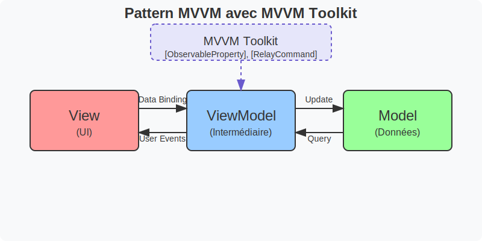

# MAUI MVVM (avec le toolkit)

Le modèle MVVM (Model-View-ViewModel) est un pattern architectural qui sépare clairement l'interface utilisateur de la
logique métier dans les applications. Il se compose de trois couches distinctes : le Modèle (données et logique métier),
la Vue (interface utilisateur) et le ViewModel (intermédiaire qui connecte les deux). Le MVVM Toolkit, en particulier le
CommunityToolkit.Mvvm pour .NET MAUI, simplifie considérablement l'implémentation de ce pattern grâce à des annotations
comme [ObservableProperty] et [RelayCommand] qui génèrent automatiquement du code à la compilation, réduisant ainsi la
verbosité et facilitant le développement d'applications respectant le principe de séparation des préoccupations.



Le schéma ci-dessus illustre comment le MVVM Toolkit facilite la mise en œuvre du pattern MVVM en fournissant des outils
qui automatisent les connexions entre ses trois composants essentiels.

## Les principales annotations

### 1. [ObservableProperty]

Cette annotation génère automatiquement une propriété observable qui notifie l'interface utilisateur des changements.

**Exemple pas à pas:**

```csharp
// ViewModel
using CommunityToolkit.Mvvm.ComponentModel;

public partial class MainViewModel : ObservableObject
{
    [ObservableProperty]
    private string _name;
    
    [ObservableProperty]
    private int _age;
}
```

Ce code génère automatiquement :

- Les propriétés publiques `Name` et `Age`
- Les notifications de changement de propriété
- Les méthodes OnNameChanged et OnAgeChanged (que vous pouvez surcharger)

### 2. [RelayCommand]

Cette annotation génère des commandes qui peuvent être liées à des actions UI (attribut `Command` dans le XAML).

**Exemple pas à pas:**

```csharp
public partial class MainViewModel : ObservableObject
{
    [ObservableProperty]
    private string _message = "Bonjour";
    
    [RelayCommand]
    private void SayHello()
    {
        Message = "Bonjour tout le monde!";
    }
    
    [RelayCommand]
    private async Task LoadDataAsync()
    {
        // Code asynchrone
        await Task.Delay(1000);
        Message = "Données chargées";
    }
}
```

Dans votre XAML:

```xml

<Button Text="Dire Bonjour" Command="{Binding SayHelloCommand}"/>
<Button Text="Charger" Command="{Binding LoadDataCommand}"/>
<Label Text="{Binding Message}"/>
```

### 3. [INotifyPropertyChanged]

Cette génération est automatique quand votre classe hérite de `ObservableObject`.

### 4. [NotifyPropertyChangedFor]

Cette annotation notifie qu'une propriété dépendante doit être mise à jour.

**Exemple:**

```csharp
public partial class MainViewModel : ObservableObject
{
    [ObservableProperty]
    [NotifyPropertyChangedFor(nameof(FullName))]
    private string _firstName;
    
    [ObservableProperty]
    [NotifyPropertyChangedFor(nameof(FullName))]
    private string _lastName;
    
    public string FullName => $"{FirstName} {LastName}";
}
```

## Exemple complet pas à pas

Créons une petite application de gestion de tâches:

### 1. Modèle de données

```csharp
// Models/TodoItem.cs
public class TodoItem
{
    public string Title { get; set; }
    public bool IsCompleted { get; set; }
}
```

### 2. ViewModel avec annotations

```csharp
// ViewModels/TodoViewModel.cs
using CommunityToolkit.Mvvm.ComponentModel;
using CommunityToolkit.Mvvm.Input;
using System.Collections.ObjectModel;

public partial class TodoViewModel : ObservableObject
{
    public TodoViewModel()
    {
        TodoItems = new ObservableCollection<TodoItem>();
    }
    
    [ObservableProperty]
    private ObservableCollection<TodoItem> _todoItems;
    
    [ObservableProperty]
    private string _newTodoTitle;
    
    [ObservableProperty]
    [NotifyPropertyChangedFor(nameof(HasItems))]
    private TodoItem _selectedItem;
    
    public bool HasItems => TodoItems.Count > 0;
    
    [RelayCommand]
    private void AddTodo()
    {
        if (string.IsNullOrWhiteSpace(NewTodoTitle))
            return;
            
        TodoItems.Add(new TodoItem { Title = NewTodoTitle });
        NewTodoTitle = string.Empty; // Réinitialise le champ
        OnPropertyChanged(nameof(HasItems));
    }
    
    [RelayCommand]
    private void RemoveTodo(TodoItem item)
    {
        if (item != null)
        {
            TodoItems.Remove(item);
            OnPropertyChanged(nameof(HasItems));
        }
    }
    
    [RelayCommand]
    private void ToggleCompleted(TodoItem item)
    {
        if (item != null)
        {
            item.IsCompleted = !item.IsCompleted;
        }
    }
}
```

### 3. Configuration dans App.xaml.cs

```csharp
public partial class App : Application
{
    public App()
    {
        InitializeComponent();
        
        // Enregistrement des services
        var services = new ServiceCollection();
        services.AddSingleton<TodoViewModel>();
        services.AddSingleton<MainPage>();
        
        var provider = services.BuildServiceProvider();
        
        MainPage = provider.GetRequiredService<MainPage>();
    }
}
```

### 4. Vue XAML

```xml
<!-- MainPage.xaml -->
<ContentPage xmlns="http://schemas.microsoft.com/dotnet/2021/maui"
             xmlns:x="http://schemas.microsoft.com/winfx/2009/xaml"
             xmlns:viewmodels="clr-namespace:YourNamespace.ViewModels"
             x:Class="YourNamespace.MainPage"
             x:DataType="viewmodels:TodoViewModel">

    <Grid RowDefinitions="Auto,*" Padding="20">
        <VerticalStackLayout Grid.Row="0" Spacing="10">
            <Label Text="Nouvelle tâche:"/>
            <Grid ColumnDefinitions="*,Auto">
                <Entry Grid.Column="0" Text="{Binding NewTodoTitle}" Placeholder="Entrez une tâche..."/>
                <Button Grid.Column="1" Text="Ajouter" Command="{Binding AddTodoCommand}"/>
            </Grid>
        </VerticalStackLayout>

        <CollectionView Grid.Row="1" ItemsSource="{Binding TodoItems}"
                        SelectedItem="{Binding SelectedItem}" Margin="0,20,0,0">
            <CollectionView.EmptyView>
                <Label Text="Aucune tâche pour le moment" HorizontalOptions="Center"/>
            </CollectionView.EmptyView>
            <CollectionView.ItemTemplate>
                <DataTemplate x:DataType="models:TodoItem">
                    <SwipeView>
                        <SwipeView.RightItems>
                            <SwipeItems>
                                <SwipeItem Text="Supprimer"
                                           Command="{Binding Source={RelativeSource AncestorType={x:Type viewmodels:TodoViewModel}}, Path=RemoveTodoCommand}"
                                           CommandParameter="{Binding .}"/>
                            </SwipeItems>
                        </SwipeView.RightItems>
                        <Grid ColumnDefinitions="Auto,*" Padding="5">
                            <CheckBox Grid.Column="0" IsChecked="{Binding IsCompleted}"
                                      Command="{Binding Source={RelativeSource AncestorType={x:Type viewmodels:TodoViewModel}}, Path=ToggleCompletedCommand}"
                                      CommandParameter="{Binding .}"/>
                            <Label Grid.Column="1" Text="{Binding Title}" VerticalOptions="Center">
                                <Label.Style>
                                    <Style TargetType="Label">
                                        <Style.Triggers>
                                            <DataTrigger TargetType="Label" Binding="{Binding IsCompleted}"
                                                         Value="True">
                                                <Setter Property="TextDecorations" Value="Strikethrough"/>
                                            </DataTrigger>
                                        </Style.Triggers>
                                    </Style>
                                </Label.Style>
                            </Label>
                        </Grid>
                    </SwipeView>
                </DataTemplate>
            </CollectionView.ItemTemplate>
        </CollectionView>
    </Grid>
</ContentPage>
```

### 5. Code-behind

```csharp
// MainPage.xaml.cs
public partial class MainPage : ContentPage
{
    public MainPage(TodoViewModel viewModel)
    {
        InitializeComponent();
        BindingContext = viewModel;
    }
}
```

## Points clés à retenir

1. Utiliser `partial class` avec les annotations MVVM
2. Hériter de `ObservableObject` pour activer les notifications
3. Les annotations génèrent du code à la compilation

Cette implémentation MVVM avec les annotations du toolkit rend le code plus propre, plus maintenable et plus facile à
tester.