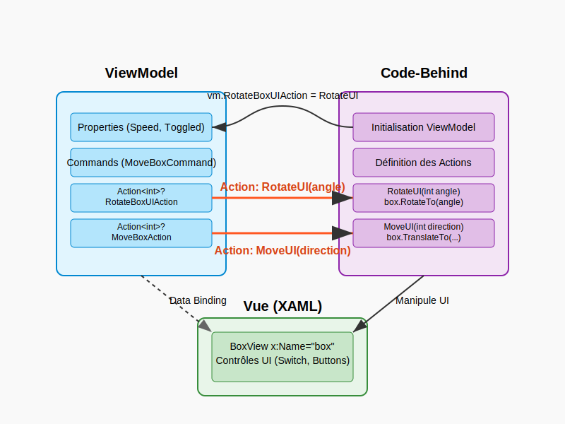

# Introduction aux animations dans .NET MAUI

Les animations constituent un élément essentiel dans le développement d'interfaces utilisateur modernes. Elles
permettent d'améliorer l'expérience utilisateur en fournissant des retours visuels sur les interactions et en rendant
l'application plus dynamique et engageante.

.NET MAUI offre un système d'animation puissant et flexible qui peut être facilement intégré avec le modèle
architectural MVVM (Model-View-ViewModel) pour créer des interfaces utilisateur interactives tout en maintenant une
séparation claire des préoccupations.

## Théorie des animations dans .NET MAUI

### Types d'animations de base

.NET MAUI prend en charge plusieurs types d'animations fondamentales :

1. **Fade (Opacité)** : Modifications de la propriété `Opacity` pour faire apparaître ou disparaître progressivement un
   élément.
2. **Rotate (Rotation)** : Utilisation de la propriété `Rotation` pour faire pivoter un élément selon un angle spécifié.
3. **Scale (Mise à l'échelle)** : Modification de la propriété `Scale` pour agrandir ou réduire un élément.
4. **Translate (Translation)** : Déplacement d'un élément en modifiant ses propriétés `TranslationX` et `TranslationY`.
5. Et [d'autres encore](https://learn.microsoft.com/en-us/dotnet/maui/user-interface/animation/basic?view=net-maui-9.0)

### Méthodes d'animation

.NET MAUI fournit plusieurs méthodes d'extension pour animer des éléments visuels :

- `FadeTo()` : Anime la propriété d'opacité d'un élément.
- `RotateTo()` : Anime la rotation d'un élément.
- `ScaleTo()` : Anime la taille d'un élément.
- `TranslateTo()` : Anime la position d'un élément.

Ces méthodes retournent des `Task<bool>`, ce qui permet de les utiliser avec `async/await` pour créer des séquences
d'animations.

### Communication entre ViewModel et View pour les animations

Dans un contexte MVVM, le ViewModel ne devrait pas avoir de référence directe aux éléments de l'interface utilisateur.
Pour gérer les animations, nous pouvons utiliser plusieurs approches :

1. **Actions et délégués** : Le code-behind de la vue définit des actions qui exécutent les animations, et le ViewModel
   les appelle.
2. **Liaison de données** : Liaison des propriétés animables (Opacity, Rotation, etc.) aux propriétés du ViewModel.
3. **Triggers et Behaviors** : Utilisation de déclencheurs et comportements pour réagir aux changements dans le
   ViewModel.



#### Explication du schéma de communication

Le schéma ci-dessus illustre la communication entre les différentes couches du modèle MVVM pour gérer les animations :

##### 1. Connexion initiale (Phase d'initialisation)

Lorsque la page est initialisée, le code-behind récupère le ViewModel à partir du BindingContext et établit les
connexions nécessaires :

```csharp
var vm = BindingContext as AnimateViewModel;
if (vm != null)
{
    vm.RotateBoxUIAction = RotateUI;
    vm.MoveBoxAction = MoveUI;
}
```

Cette étape est cruciale car elle établit les "ponts" entre la logique métier (ViewModel) et l'interface utilisateur (
Code-behind).

##### 2. Flux de données bidirectionnel

- **Liaison de données (Data Binding)** : Les propriétés du ViewModel sont liées aux éléments UI dans le XAML,
  permettant une synchronisation automatique (représentée par la ligne pointillée dans le schéma entre le ViewModel et
  la Vue).

- **Actions** : Les méthodes d'animation définies dans le code-behind sont exposées au ViewModel via des délégués
  Action<int> (représentées par les flèches orange).

##### 3. Déclenchement des animations

Lorsqu'une action est requise (par exemple, une rotation), le flux d'exécution suit ce chemin :

1. Le ViewModel détermine qu'une animation est nécessaire (par exemple, en réponse à une commande ou un changement
   d'état).
2. Le ViewModel invoque l'action correspondante : `RotateBoxUIAction?.Invoke(angle)`.
3. L'action exécute la méthode liée dans le code-behind : `RotateUI(angle)`.
4. La méthode du code-behind utilise les API d'animation .NET MAUI pour animer l'élément UI : `box.RotateTo(angle)`.

## Exemple pas à pas : Animation d'un BoxView

Suivons maintenant un exemple concret en nous basant sur le code fourni.

### Étape 1 : Création du ViewModel

```csharp
using System;
using System.Diagnostics;
using System.Windows.Input;
using CommunityToolkit.Mvvm.ComponentModel;
using CommunityToolkit.Mvvm.Input;
using Microsoft.Maui.Controls;

namespace MauiAnimationDemo.ViewModels
{
    public partial class AnimateViewModel : ObservableObject
    {
        [ObservableProperty]
        private bool _toggled;

        [ObservableProperty]
        private string _label = "Rotation inactive";

        [ObservableProperty]
        private int _speed = 10;

        private int _currentAngle = 0;
        private bool _isRotating = false;

        // Action qui sera définie dans le code-behind pour effectuer la rotation
        public Action<int>? RotateBoxUIAction { get; set; }
        
        // Action qui sera définie dans le code-behind pour effectuer le déplacement
        public Action<int>? MoveUIAction { get; set; }

        public AnimateViewModel()
        {
            // Démarrer une tâche en arrière-plan pour gérer la rotation continue
            StartRotationTask();
        }

        // Méthode appelée lorsque la propriété Toggled change
        partial void OnToggledChanged(bool value)
        {
            Label = value ? "Rotation active" : "Rotation inactive";
            _isRotating = value;
        }

        // Commande pour déplacer la boîte
        [RelayCommand]
        private void MoveBox(int direction)
        {
            if (MoveUIAction != null)
            {
                MoveUIAction.Invoke(direction);
            }
            else
            {
                Debug.WriteLine($"No move action defined, would move {direction}");
            }
        }

        // Méthode pour déclencher la rotation
        private void RotateBox(int angle)
        {
            if (RotateBoxUIAction != null)
            {
                RotateBoxUIAction.Invoke(angle);
            }
            else
            {
                Debug.WriteLine($"No rotation action defined, would rotate {angle}");
            }
        }

        // Tâche en arrière-plan pour gérer la rotation continue
        private async void StartRotationTask()
        {
            while (true)
            {
                if (_isRotating)
                {
                    _currentAngle = (_currentAngle + Speed) % 360;
                    RotateBox(_currentAngle);
                }
                
                // Attendre pour contrôler la fréquence des mises à jour
                await Task.Delay(50);
            }
        }
    }
}
```

### Étape 2 : Création de la Vue XAML

```csharp
<?xml version="1.0" encoding="utf-8" ?>
<ContentPage xmlns="http://schemas.microsoft.com/dotnet/2021/maui"
             xmlns:x="http://schemas.microsoft.com/winfx/2009/xaml"
             xmlns:s="clr-namespace:System;assembly=netstandard"
             xmlns:viewmodels="clr-namespace:MauiAnimationDemo.ViewModels"
             x:Class="MauiAnimationDemo.Views.AnimatePage"
             Title="Animations MAUI avec MVVM">

    <ContentPage.BindingContext>
        <viewmodels:AnimateViewModel />
    </ContentPage.BindingContext>

    <Grid Padding="20">
        <VerticalStackLayout Spacing="10">
            
            <!-- BoxView qui sera animé -->
            <BoxView x:Name="box" 
                     Margin="0,30,0,0" 
                     Color="Aqua" 
                     WidthRequest="150" 
                     HeightRequest="150" 
                     HorizontalOptions="Center" />
               
            <!-- Switch de rotation -->
            <HorizontalStackLayout HorizontalOptions="Center" Margin="0,25,0,0">
                <Label Text="{Binding Label}" VerticalTextAlignment="Center" />
                <Switch IsToggled="{Binding Toggled}" />
            </HorizontalStackLayout>
               
            <!-- Déplacement avec les boutons -->
            <HorizontalStackLayout HorizontalOptions="Center" Margin="0,25,0,0">
                <Button Text="&lt;&lt;" Command="{Binding MoveBoxCommand}">
                    <Button.CommandParameter>
                        <s:Int32>-1</s:Int32>
                    </Button.CommandParameter>
                </Button>
                <Button Text=">>" Margin="10,0,0,0" Command="{Binding MoveBoxCommand}">
                    <Button.CommandParameter>
                        <s:Int32>+1</s:Int32>
                    </Button.CommandParameter>
                </Button>
            </HorizontalStackLayout>
               
            <!-- Ajustement de la vitesse -->
            <StackLayout Orientation="Horizontal" HorizontalOptions="Center">
                <Label Text="{Binding Speed,StringFormat='Speed {0}'}" />
                <Slider WidthRequest="150" Value="{Binding Speed}" Minimum="1" Maximum="50" />
            </StackLayout>
        
        </VerticalStackLayout>
    </Grid>
</ContentPage>
```

### Étape 3 : Création du Code-Behind de la Vue

```csharp
using MauiAnimationDemo.ViewModels;
using System.Diagnostics;

namespace MauiAnimationDemo.Views
{
    public partial class AnimatePage : ContentPage
    {
        // Position actuelle pour l'animation de déplacement
        private double _currentX = 0;
        
        public AnimatePage()
        {
            InitializeComponent();
            
            // Récupération du ViewModel depuis le BindingContext
            var vm = BindingContext as AnimateViewModel;
            
            if (vm != null)
            {
                // Association des méthodes d'animation aux actions du ViewModel
                vm.RotateBoxUIAction = RotateUI;
                vm.MoveUIAction = MoveUI;
            }
        }
        
        // Méthode pour effectuer la rotation du BoxView
        private void RotateUI(int angle)
        {
            this.box.RotateTo(angle);
        }
        
        // Méthode pour effectuer le déplacement du BoxView
        private async void MoveUI(int direction)
        {
            // Calcul de la nouvelle position
            _currentX += direction * 50; // Déplacement de 50 pixels dans la direction spécifiée
            
            // Animation de déplacement
            await this.box.TranslateTo(_currentX, 0, 250, Easing.SpringOut);
        }
    }
}
```

## Explication détaillée de l'exemple

### Approche MVVM pour les animations

Dans cet exemple, nous utilisons une approche MVVM pour gérer les animations tout en maintenant une séparation claire
des préoccupations :

1. **ViewModel (AnimateViewModel)** : Contient la logique métier et les commandes qui déclenchent les animations. Le
   ViewModel reste indépendant de l'interface utilisateur et ne fait pas référence directement aux éléments visuels.

2. **Vue (AnimatePage.xaml)** : Définit la structure de l'interface utilisateur, y compris le BoxView à animer et les
   contrôles pour déclencher les animations (boutons, switch, slider).

3. **Code-behind (AnimatePage.xaml.cs)** : Contient le code spécifique à l'interface utilisateur pour exécuter les
   animations. Il définit les méthodes d'animation qui sont connectées au ViewModel via des actions (délégués).

### Communication entre Vue et ViewModel

La communication entre la Vue et le ViewModel se fait par deux mécanismes principaux :

1. **Liaison de données (Data Binding)** : Les propriétés du ViewModel (Toggled, Label, Speed) sont liées aux éléments
   de l'interface utilisateur correspondants.

2. **Actions/Délégués** : Pour les opérations qui nécessitent une interaction directe avec l'interface utilisateur (
   comme les animations), le ViewModel expose des actions (`RotateBoxUIAction`, `MoveBoxAction`) qui sont définies dans
   le code-behind de la Vue.

### Types d'animations implémentés

Dans cet exemple, nous avons implémenté deux types d'animations :

1. **Rotation (RotateTo)** : Le BoxView tourne en fonction de la valeur de l'angle fournie par le ViewModel.
    - Contrôlée par un Switch qui active/désactive la rotation continue.
    - La vitesse de rotation est ajustable via un Slider.

2. **Translation (TranslateTo)** : Le BoxView se déplace horizontalement en réponse aux boutons de direction.
    - Les boutons "<<" et ">>" déplacent le BoxView vers la gauche ou la droite.
    - L'animation utilise un effet d'élasticité (`Easing.SpringOut`) pour un rendu plus naturel.

## Résumé des concepts clés

1. **Séparation des préoccupations** : Le ViewModel gère la logique, la Vue définit l'interface, et le code-behind
   implémente les animations spécifiques à l'interface utilisateur.

2. **Actions et délégués** : Permettent au ViewModel de déclencher des animations sans avoir de référence directe aux
   éléments de l'interface utilisateur.

3. **Animation continue** : Utilisation d'une tâche en arrière-plan pour créer une animation continue (rotation) basée
   sur un état (Toggled) et un paramètre ajustable (Speed).

4. **Animation ponctuelle** : Déclenchement d'animations à la demande (déplacement) en réponse à des commandes.

5. **Méthodes d'animation .NET MAUI** : Utilisation des méthodes d'extension d'animation intégrées (`RotateTo`,
   `TranslateTo`) qui retournent des `Task` et peuvent être utilisées avec `async/await`.

## Action et délégués dans le modèle MVVM pour les animations

Pour bien comprendre l'exemple, il est utile d'éclaircir les concepts de délégués et d'actions en C#.

### Délégués et Actions

Un **délégué** en C# est un type qui représente des références à des méthodes avec une liste de paramètres et un type de
retour spécifiques. Les délégués permettent de passer des méthodes en tant que paramètres à d'autres méthodes, ce qui
est fondamental pour les modèles de conception basés sur les événements.

>Autrement dit, une action représente un *nouveau* type `fonction` au même titre que *int* est un type pour des nombres
entiers...

**Action** est un type de délégué générique prédéfini en C# qui encapsule une méthode ne retournant aucune valeur (
void). Il peut accepter jusqu'à 16 paramètres de types variés.

```csharp
// Déclaration d'une Action qui accepte un paramètre de type int
public Action<int>? MyAction { get; set; }

// Invocation de l'Action
MyAction?.Invoke(42);
```

### Actions dans le modèle MVVM

Dans le contexte MVVM, les Actions offrent plusieurs avantages :

1. **Séparation des préoccupations** : Le ViewModel peut déclencher des opérations spécifiques à l'interface utilisateur
   sans référence directe aux contrôles UI.

2. **Testabilité** : Le ViewModel reste testable indépendamment de l'interface utilisateur, car les Actions peuvent être
   remplacées par des versions simulées lors des tests.

3. **Flexibilité** : Le même ViewModel peut être utilisé avec différentes implémentations d'interface utilisateur,
   chacune définissant ses propres actions.
