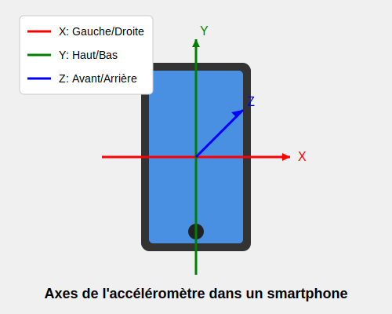

# Gestion de l'accéléromètre dans .NET MAUI

## Théorie

.NET MAUI offre une API unifiée pour accéder aux capteurs de l'appareil, dont l'accéléromètre, via l'espace de noms
`Microsoft.Maui.Devices.Sensors`. L'accéléromètre mesure l'accélération de l'appareil sur trois axes :

- **X** : Accélération latérale (gauche/droite)
- **Y** : Accélération longitudinale (haut/bas)
- **Z** : Accélération perpendiculaire à l'écran (avant/arrière)



Les valeurs sont exprimées en G (9,81 m/s²).

## 1. Exemple basique (sans MVVM)

### XAML (vue)

```xml

<ContentPage xmlns="http://schemas.microsoft.com/dotnet/2021/maui"
             xmlns:x="http://schemas.microsoft.com/winfx/2009/xaml"
             x:Class="MauiAccelerometerDemo.BasicAccelerometerPage"
             Title="Accéléromètre">
    <VerticalStackLayout Padding="20" Spacing="15" VerticalOptions="Center">
        <Label Text="Valeurs de l'accéléromètre" FontSize="Large" HorizontalOptions="Center"/>
        <Label x:Name="lblStatus" Text="Lecture des données..."/>
        <Label x:Name="lblX" Text="X: 0.00"/>
        <Label x:Name="lblY" Text="Y: 0.00"/>
        <Label x:Name="lblZ" Text="Z: 0.00"/>
    </VerticalStackLayout>
</ContentPage>
```

### Code behind

```csharp
using Microsoft.Maui.Devices.Sensors;

public partial class BasicAccelerometerPage : ContentPage
{
    public BasicAccelerometerPage()
    {
        InitializeComponent();
        
        // Vérifier si l'accéléromètre est disponible
        if (Accelerometer.Default.IsSupported)
        {
            // Définir la fréquence de mise à jour (peut être Low, Medium, High)
            Accelerometer.Default.ShakeDetected += Accelerometer_ShakeDetected;
            Accelerometer.Default.ReadingChanged += Accelerometer_ReadingChanged;
            
            // Démarrer la surveillance
            if (!Accelerometer.Default.IsMonitoring)
            {
                Accelerometer.Default.Start(SensorSpeed.UI);
            }
        }
        else
        {
            lblStatus.Text = "L'accéléromètre n'est pas disponible sur cet appareil.";
        }
    }

    private void Accelerometer_ReadingChanged(object sender, AccelerometerChangedEventArgs e)
    {
        // Accéder aux valeurs de l'accéléromètre
        AccelerometerData data = e.Reading;
        
        // Mettre à jour l'interface utilisateur sur le thread UI
        MainThread.BeginInvokeOnMainThread(() =>
        {
            lblX.Text = $"X: {data.Acceleration.X:F2}";
            lblY.Text = $"Y: {data.Acceleration.Y:F2}";
            lblZ.Text = $"Z: {data.Acceleration.Z:F2}";
        });
    }

    private void Accelerometer_ShakeDetected(object sender, EventArgs e)
    {
        MainThread.BeginInvokeOnMainThread(async () =>
        {
            // Action à effectuer lors de la détection d'une secousse
            await DisplayAlert("Secousse détectée", "L'appareil a été secoué!", "OK");
        });
    }

    protected override void OnDisappearing()
    {
        if (Accelerometer.Default.IsSupported)
        {
            // Arrêter la surveillance et supprimer les gestionnaires d'événements
            Accelerometer.Default.Stop();
            Accelerometer.Default.ReadingChanged -= Accelerometer_ReadingChanged;
            Accelerometer.Default.ShakeDetected -= Accelerometer_ShakeDetected;
        }
        
        base.OnDisappearing();
    }
}
```


## 2. Implémentation avec MVVM

### Théorie

Pour rappel, le modèle MVVM (Model-View-ViewModel) permet de séparer l'interface utilisateur (View) de la logique métier (ViewModel)
et des données (Model). Cette séparation facilite les tests unitaires et améliore la maintenabilité du code.

### Code 
#### AccelerometerViewModel.cs

```csharp
using CommunityToolkit.Mvvm.ComponentModel;
using CommunityToolkit.Mvvm.Input;
using Microsoft.Maui.Devices.Sensors;

namespace MauiAccelerometerDemo.ViewModels
{
    /// <summary>
    /// ViewModel pour l'accéléromètre utilisant MVVM Toolkit
    /// </summary>
    public partial class AccelerometerViewModel : ObservableObject
    {
        [ObservableProperty]
        private double xValue;

        [ObservableProperty]
        private double yValue;

        [ObservableProperty]
        private double zValue;

        [ObservableProperty]
        private string status = "Prêt à commencer la surveillance";

        [ObservableProperty]
        [NotifyCanExecuteChangedFor(nameof(StartMonitoringCommand))]
        [NotifyCanExecuteChangedFor(nameof(StopMonitoringCommand))]
        private bool isMonitoring;

        public AccelerometerViewModel()
        {
            // Vérifier si l'accéléromètre est supporté
            if (!Accelerometer.Default.IsSupported)
            {
                Status = "L'accéléromètre n'est pas disponible sur cet appareil.";
            }
        }

        [RelayCommand(CanExecute = nameof(CanStartMonitoring))]
        private void StartMonitoring()
        {
            if (!Accelerometer.Default.IsSupported)
                return;

            Accelerometer.Default.ReadingChanged += OnReadingChanged;
            Accelerometer.Default.ShakeDetected += OnShakeDetected;
            Accelerometer.Default.Start(SensorSpeed.UI);
            
            IsMonitoring = true;
            Status = "Surveillance en cours...";
        }

        private bool CanStartMonitoring() => !IsMonitoring;

        [RelayCommand(CanExecute = nameof(CanStopMonitoring))]
        private void StopMonitoring()
        {
            if (!Accelerometer.Default.IsSupported)
                return;

            Accelerometer.Default.ReadingChanged -= OnReadingChanged;
            Accelerometer.Default.ShakeDetected -= OnShakeDetected;
            Accelerometer.Default.Stop();
            
            IsMonitoring = false;
            Status = "Surveillance arrêtée";
        }

        private bool CanStopMonitoring() => IsMonitoring;

        private void OnReadingChanged(object sender, AccelerometerChangedEventArgs e)
        {
            MainThread.BeginInvokeOnMainThread(() =>
            {
                XValue = Math.Round(e.Reading.Acceleration.X, 2);
                YValue = Math.Round(e.Reading.Acceleration.Y, 2);
                ZValue = Math.Round(e.Reading.Acceleration.Z, 2);
            });
        }

        private void OnShakeDetected(object sender, EventArgs e)
        {
            MainThread.BeginInvokeOnMainThread(() =>
            {
                Status = "Secousse détectée!";
                // Réinitialiser après 2 secondes
                Task.Delay(2000).ContinueWith(_ => 
                {
                    MainThread.BeginInvokeOnMainThread(() => 
                    {
                        Status = "Surveillance en cours...";
                    });
                });
            });
        }

        /// <summary>
        /// Libère les ressources et arrête la surveillance
        /// </summary>
        public void Cleanup()
        {
            if (IsMonitoring)
            {
                StopMonitoring();
            }
        }
    }
}
```

#### MvvmAccelerometerPage.xaml

```xml

<ContentPage xmlns="http://schemas.microsoft.com/dotnet/2021/maui"
             xmlns:x="http://schemas.microsoft.com/winfx/2009/xaml"
             xmlns:viewmodels="clr-namespace:MauiAccelerometerDemo.ViewModels"
             x:Class="MauiAccelerometerDemo.Views.MvvmAccelerometerPage"
             Title="Accéléromètre MVVM">

    <ContentPage.BindingContext>
        <viewmodels:AccelerometerViewModel/>
    </ContentPage.BindingContext>

    <Grid Padding="20" RowSpacing="15" ColumnSpacing="15">
        <Grid.RowDefinitions>
            <RowDefinition Height="Auto"/>
            <RowDefinition Height="Auto"/>
            <RowDefinition Height="Auto"/>
            <RowDefinition Height="Auto"/>
            <RowDefinition Height="Auto"/>
            <RowDefinition Height="*"/>
        </Grid.RowDefinitions>
        <Grid.ColumnDefinitions>
            <ColumnDefinition Width="*"/>
            <ColumnDefinition Width="*"/>
        </Grid.ColumnDefinitions>

        <Label Text="Accéléromètre MVVM"
               Grid.Row="0" Grid.ColumnSpan="2"
               FontSize="Large" HorizontalOptions="Center"/>

        <Label Text="{Binding Status}"
               Grid.Row="1" Grid.ColumnSpan="2"
               HorizontalOptions="Center"/>

        <Frame Grid.Row="2" Grid.ColumnSpan="2" Padding="10" Margin="0,10">
            <VerticalStackLayout Spacing="10">
                <Label Text="{Binding XValue, StringFormat='X: {0:F2}'}"/>
                <Label Text="{Binding YValue, StringFormat='Y: {0:F2}'}"/>
                <Label Text="{Binding ZValue, StringFormat='Z: {0:F2}'}"/>
            </VerticalStackLayout>
        </Frame>

        <Button Text="Démarrer"
                Command="{Binding StartMonitoringCommand}"
                Grid.Row="3" Grid.Column="0"
                HorizontalOptions="Fill"/>

        <Button Text="Arrêter"
                Command="{Binding StopMonitoringCommand}"
                Grid.Row="3" Grid.Column="1"
                HorizontalOptions="Fill"/>

        <!-- Représentation visuelle de l'orientation -->
        <Frame Grid.Row="4" Grid.ColumnSpan="2" HeightRequest="200" Padding="0" Margin="0,20">
            <GraphicsView x:Name="OrientationGraphics"/>
        </Frame>
    </Grid>
</ContentPage>
```

#### MvvmAccelerometerPage.xaml.cs

```csharp
using MauiAccelerometerDemo.ViewModels;
using Microsoft.Maui.Graphics;

namespace MauiAccelerometerDemo.Views
{
    public partial class MvvmAccelerometerPage : ContentPage
    {
        private AccelerometerViewModel _viewModel;
        
        public MvvmAccelerometerPage()
        {
            InitializeComponent();
            _viewModel = (AccelerometerViewModel)BindingContext;
            
            // Créer un dessin personnalisé pour représenter l'orientation
            OrientationGraphics.Drawable = new OrientationDrawable(_viewModel);
        }
        
        protected override void OnDisappearing()
        {
            base.OnDisappearing();
            
            // Assurer que les ressources sont libérées
            if (_viewModel.IsMonitoring)
            {
                _viewModel.StopMonitoringCommand.Execute(null);
            }
        }
    }
    
    // Classe pour visualiser l'orientation
    public class OrientationDrawable : IDrawable
    {
        private readonly AccelerometerViewModel _viewModel;
        
        public OrientationDrawable(AccelerometerViewModel viewModel)
        {
            _viewModel = viewModel;
        }
        
        public void Draw(ICanvas canvas, RectF dirtyRect)
        {
            canvas.FillColor = Colors.White;
            canvas.FillRectangle(dirtyRect);
            
            // Calcul du centre
            var centerX = dirtyRect.Width / 2;
            var centerY = dirtyRect.Height / 2;
            
            // Taille du téléphone
            var phoneWidth = dirtyRect.Width * 0.5f;
            var phoneHeight = dirtyRect.Height * 0.7f;
            
            // Appliquer la rotation en fonction des valeurs de l'accéléromètre
            canvas.SaveState();
            canvas.Translate(centerX, centerY);
            
            // Rotation basée sur les valeurs X et Y
            var rotationX = (float)(_viewModel.YValue * 25); // Incliner en fonction de Y
            var rotationY = (float)(-_viewModel.XValue * 25); // Incliner en fonction de X inverse
            
            canvas.RotateRadians((float)(rotationY * Math.PI / 180), 0, 0);
            canvas.RotateRadians((float)(rotationX * Math.PI / 180), 0, 0);
            
            // Dessiner le téléphone
            canvas.FillColor = Colors.LightGray;
            canvas.FillRoundedRectangle(-phoneWidth/2, -phoneHeight/2, phoneWidth, phoneHeight, 10);
            
            // Dessiner l'écran
            canvas.FillColor = Colors.DarkBlue;
            canvas.FillRoundedRectangle(-phoneWidth/2 + 5, -phoneHeight/2 + 5, phoneWidth - 10, phoneHeight - 10, 5);
            
            canvas.RestoreState();
        }
    }
}
```

## 3. Mode simplifié avec ShakeDetected


### Théorie

Si on n'a besoin que de détecter les secousses (shake) sans traiter les données
brutes de l'accéléromètre. .NET MAUI fournit un événement spécifique pour cela : `ShakeDetected`.

### Exemple de code simplifié

```csharp
using Microsoft.Maui.Devices.Sensors;

namespace MauiAccelerometerDemo
{
    public class ShakeDetectionService
    {
        private bool _isMonitoring;
        
        public event EventHandler ShakeDetected;
        
        public bool IsAvailable => Accelerometer.Default.IsSupported;
        
        public bool IsMonitoring => _isMonitoring;
        
        public void StartMonitoring()
        {
            if (!IsAvailable || _isMonitoring)
                return;
                
            Accelerometer.Default.ShakeDetected += OnShakeDetected;
            Accelerometer.Default.Start(SensorSpeed.Game);
            _isMonitoring = true;
        }
        
        public void StopMonitoring()
        {
            if (!IsAvailable || !_isMonitoring)
                return;
                
            Accelerometer.Default.ShakeDetected -= OnShakeDetected;
            Accelerometer.Default.Stop();
            _isMonitoring = false;
        }
        
        private void OnShakeDetected(object sender, EventArgs e)
        {
            ShakeDetected?.Invoke(this, EventArgs.Empty);
        }
    }
}
```

### Page pour utiliser ce service

```csharp
public partial class ShakeDetectionPage : ContentPage
{
    private readonly ShakeDetectionService _shakeService;
    private int _shakeCount = 0;
    
    public ShakeDetectionPage()
    {
        InitializeComponent();
        
        _shakeService = new ShakeDetectionService();
        
        if (_shakeService.IsAvailable)
        {
            statusLabel.Text = "Prêt à détecter les secousses";
            _shakeService.ShakeDetected += OnShakeDetected;
        }
        else
        {
            statusLabel.Text = "L'accéléromètre n'est pas disponible sur cet appareil.";
            startButton.IsEnabled = false;
            stopButton.IsEnabled = false;
        }
    }
    
    private void OnStartButtonClicked(object sender, EventArgs e)
    {
        _shakeService.StartMonitoring();
        statusLabel.Text = "Détection de secousses activée - Secouez l'appareil!";
        startButton.IsEnabled = false;
        stopButton.IsEnabled = true;
    }
    
    private void OnStopButtonClicked(object sender, EventArgs e)
    {
        _shakeService.StopMonitoring();
        statusLabel.Text = "Détection de secousses désactivée";
        startButton.IsEnabled = true;
        stopButton.IsEnabled = false;
    }
    
    private void OnShakeDetected(object sender, EventArgs e)
    {
        MainThread.BeginInvokeOnMainThread(() =>
        {
            _shakeCount++;
            countLabel.Text = $"Nombre de secousses: {_shakeCount}";
            
            // Animation simple
            countLabel.Scale = 1.5;
            countLabel.ScaleTo(1.0, 500, Easing.SpringOut);
        });
    }
    
    protected override void OnDisappearing()
    {
        base.OnDisappearing();
        
        if (_shakeService.IsMonitoring)
        {
            _shakeService.StopMonitoring();
        }
        
        _shakeService.ShakeDetected -= OnShakeDetected;
    }
}
```

```xml

<ContentPage xmlns="http://schemas.microsoft.com/dotnet/2021/maui"
             xmlns:x="http://schemas.microsoft.com/winfx/2009/xaml"
             x:Class="MauiAccelerometerDemo.ShakeDetectionPage"
             Title="Détection de secousses">
    <VerticalStackLayout Padding="20" Spacing="20" VerticalOptions="Center">
        <Label Text="Détection de secousses" FontSize="Large" HorizontalOptions="Center"/>

        <Label x:Name="statusLabel"
               Text="Initialisation..."
               HorizontalOptions="Center"/>

        <Label x:Name="countLabel"
               Text="Nombre de secousses: 0"
               FontSize="Medium"
               HorizontalOptions="Center"/>

        <Button x:Name="startButton"
                Text="Démarrer la détection"
                Clicked="OnStartButtonClicked"
                HorizontalOptions="Fill"/>

        <Button x:Name="stopButton"
                Text="Arrêter la détection"
                Clicked="OnStopButtonClicked"
                IsEnabled="False"
                HorizontalOptions="Fill"/>

        <Image Source="shake_phone.png"
               HeightRequest="200"
               HorizontalOptions="Center"
               Margin="0,20,0,0"/>
    </VerticalStackLayout>
</ContentPage>
```


## Conseils et meilleures pratiques

1. **Performances** : Choisissez la fréquence d'échantillonnage appropriée avec `SensorSpeed` :
    - `SensorSpeed.Game` : Idéal pour les jeux (haute fréquence)
    - `SensorSpeed.UI` : Adapté pour les interfaces utilisateur
    - `SensorSpeed.Default` : Équilibre entre précision et consommation
    - `SensorSpeed.Lowest` : Économie d'énergie maximale

2. **Cycle de vie** : Toujours arrêter la surveillance dans `OnDisappearing()` pour économiser la batterie.

3. **Requêtes de permissions** : Certaines plateformes nécessitent des permissions pour accéder aux capteurs. Ajoutez
   dans votre fichier `AndroidManifest.xml` :
   ```xml
   <uses-feature android:name="android.hardware.sensor.accelerometer" android:required="true" />
   ```

4. **Tests** : Utilisez l'émulateur Android ou iOS pour simuler des mouvements lors des tests.

5. **Gestion des données** : Appliquez un filtre passe-bas pour réduire le bruit dans les données d'accéléromètre :
   ```csharp
   private const float ALPHA = 0.8f; // Facteur de filtrage
   private Vector3 filteredValues = Vector3.Zero;
   
   private Vector3 LowPassFilter(Vector3 input)
   {
       filteredValues = new Vector3(
           filteredValues.X + ALPHA * (input.X - filteredValues.X),
           filteredValues.Y + ALPHA * (input.Y - filteredValues.Y),
           filteredValues.Z + ALPHA * (input.Z - filteredValues.Z)
       );
       return filteredValues;
   }
   ```
