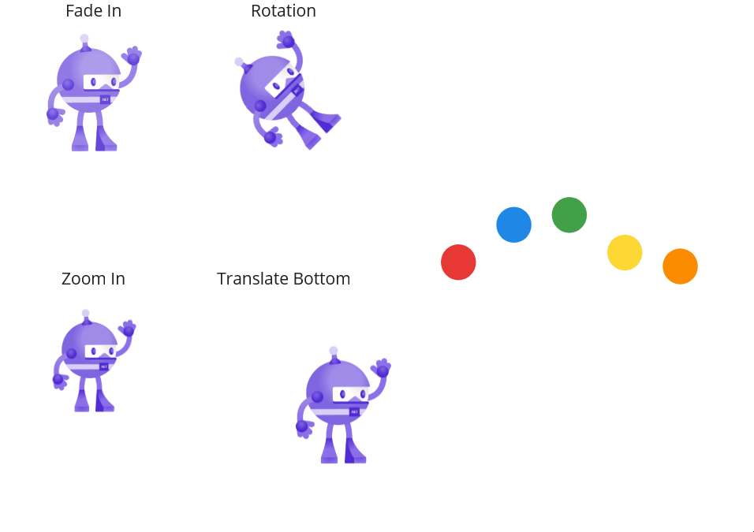

# Interaction avancée

Après la gestion simple de [CRUD](03-CRUD.md), il est temps d'aller un peu plus loin au niveau UI
en utilisant les animations...

## Théorie

### Supports
- [Animation](../supports/10-animation.md)

### Slides
- [PPT Animation](https://eduvaud-my.sharepoint.com/:p:/g/personal/jonathan_melly_eduvaud_ch/EZQ_3HmPGJZLlOUDKOeRoYYBuWullYh22hpqDWmtegahqA?e=lIoyjw)
- [PPT Accéléromètre](https://eduvaud-my.sharepoint.com/:p:/g/personal/jonathan_melly_eduvaud_ch/EZpFfpKmF_NKiIY11f79Bb4BNnbH-3QvQMcUYtTcGTmORQ?e=FUXhMA)

## Référence
- [MAUI.net >> animations](https://learn.microsoft.com/en-us/dotnet/maui/user-interface/animation/basic)

## Activités
- [ ] [Animation basique](https://labs.section-inf.ch/codelabs/mobile-06-animation/index.html?index=..%2F..index#0)
- [ ] [Flip](../activites/flip/README.md)
